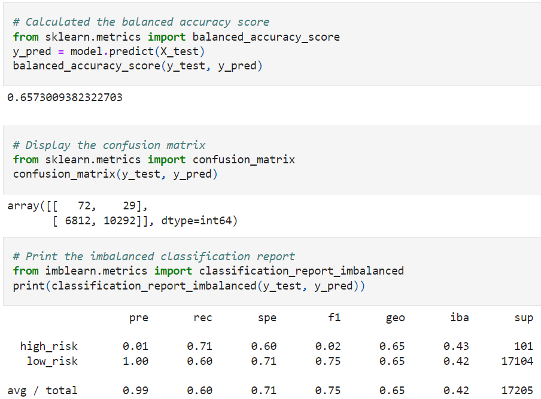
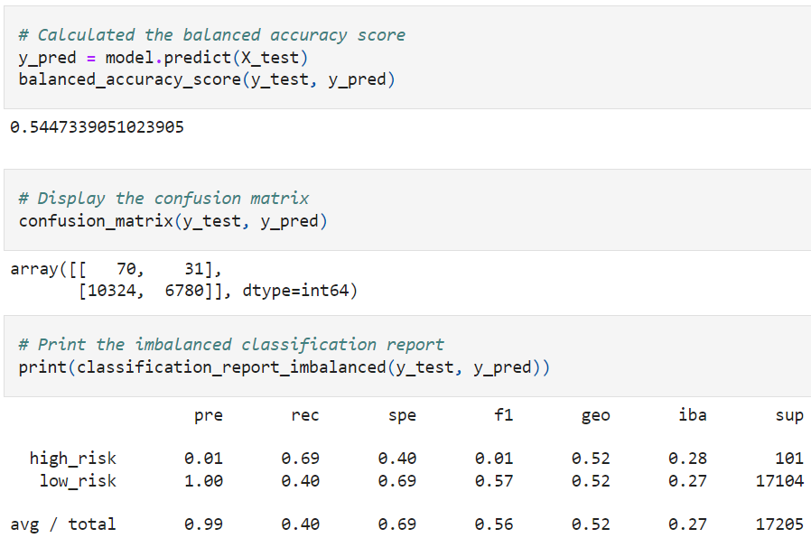
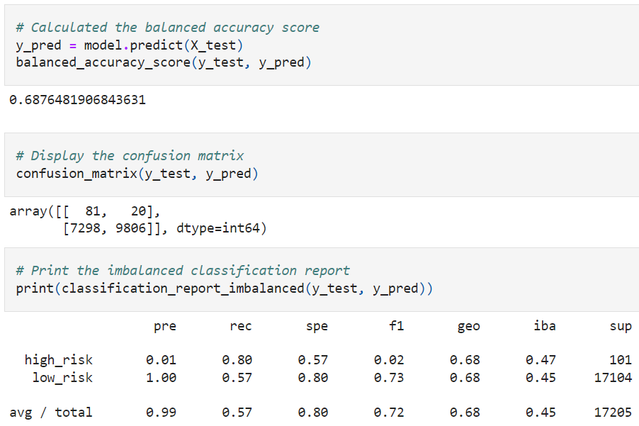

# Credit Risk Analysis
In this module, we have been learning about supervised machine learning. Specifically, we have been using Python and primarily the sklearn library to train and test models. We also learned about various ways of scoring and evaluating the models.

## Overview
For our challenge, we were asked to perform machine learning to determine credit card risk. We focused on evaluating models that can perform well with unbalanced data due to the nature of credit risk: most loans are not considered risky. Thus, we employed resampling with the imbalanced-learn and scikit-learn libraries to build and evaluate our models.

## Results
The code can be found in the two files: [Resampling](credit_risk_resampling.ipynb) and [Ensemble](credit_risk_ensemble.ipynb).

Here is how each model performed:

### Naive Random Oversampling
- Balanced Accuracy Score: 66%
- Precision for High Risk: 1%
- Recall for High Risk: 71%

### SMOTE Oversampling
- Balanced Accuracy Score: 66%
- Precision for High Risk: 1%
- Recall for High Risk: 63%

### Undersampling with Cluster Centroids
- Balanced Accuracy Score: 54%
- Precision for High Risk: 1%
- Recall for High Risk: 69%

### Combination Sampling with SMOTEENN
- Balanced Accuracy Score: 69%
- Precision for High Risk: 1%
- Recall for High Risk: 80%

### Balanced Random Forest
- Balanced Accuracy Score: 79%
- Precision for High Risk: 3%
- Recall for High Risk: 70%

### Easy Ensemble AdaBoost
- Balanced Accuracy Score: 93%
- Precision for High Risk: 3%
- Recall for High Risk: 70%

## Summary
All the models suffered with very low precision. One can look at the accuracy scores and see better numbers with the Random Forest (79%) and AdaBoost algorithms (93%), but its precisions are still only 3%. It would be difficult to recommend any of these models for a bank to use in predicting credit risk. We end up with too many false positives. If the bank were to solely rely on the algorithm to approve or deny credit, then there would be too many low-risk customers with denied credit.

Based on additional calculations, the bank could make a decision that it is in their best interest to deny these customers credit according to a low-accuracy model due to the losses for those high-risk credit individuals outweighing the benefit of the gains of the missed customers. In that case, it could also introduce controversial discussions around denying such high numbers of low-risk customers.
